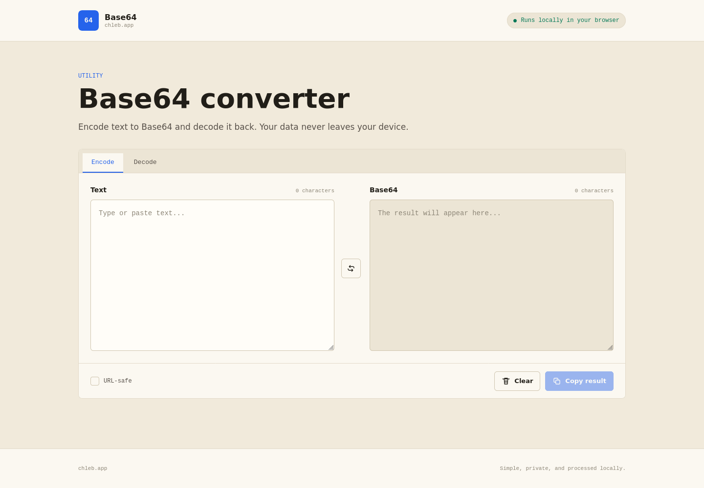
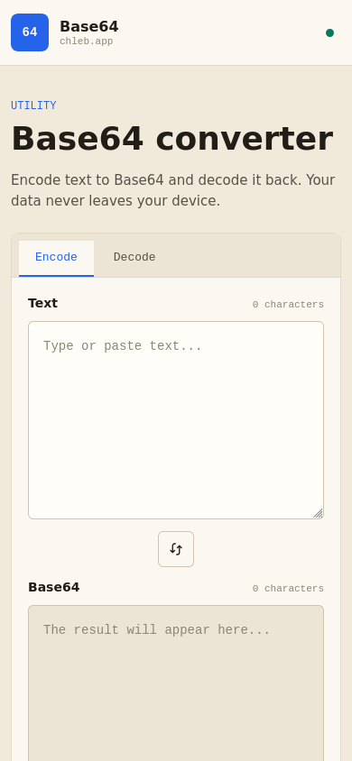

# Base64 Tool

A small, private Base64 encoder and decoder that runs entirely in the browser.

[Open the app](https://base64.chleb.app)

### Desktop



### Mobile



## Features

- Encode plain text to Base64 in real time.
- Decode Base64 back to UTF-8 text.
- Handle Unicode characters correctly.
- Generate and accept URL-safe Base64.
- Copy results to the clipboard with one click.
- Move the current result back to the input field.
- Clear both fields instantly.
- Work well on desktop and mobile screens.

## Privacy

All conversion happens locally in your browser. The app has no backend, sends no input to a server, stores no conversion history, and includes no analytics.

## Technology

The application uses plain HTML, CSS, and JavaScript with no runtime dependencies or build step. Nginx is used only when running the Docker image.

## Run locally

Open `index.html` directly in a browser, or start a local HTTP server:

```bash
python3 -m http.server 8080
```

Then open [localhost:8080](http://localhost:8080).

## Run with Docker

```bash
docker compose up -d --build
```

The app will be available at [localhost:8080](http://localhost:8080). Stop it with:

```bash
docker compose down
```

## Project structure

```text
.
├── app.js          # Conversion logic and interactions
├── compose.yaml    # Local Docker Compose setup
├── Dockerfile      # Nginx container image
├── favicon.svg     # Application icon
├── index.html      # Page structure
├── nginx.conf      # Static server and security headers
└── styles.css      # Responsive interface styles
```

## Security headers

The included server configurations set a restrictive Content Security Policy and disable access to the camera, microphone, and geolocation. They also prevent framing and MIME-type sniffing.

## Browser support

The app works in current versions of Chrome, Firefox, Safari, and Edge. It relies on standard browser APIs including `TextEncoder`, `TextDecoder`, and the Clipboard API.
